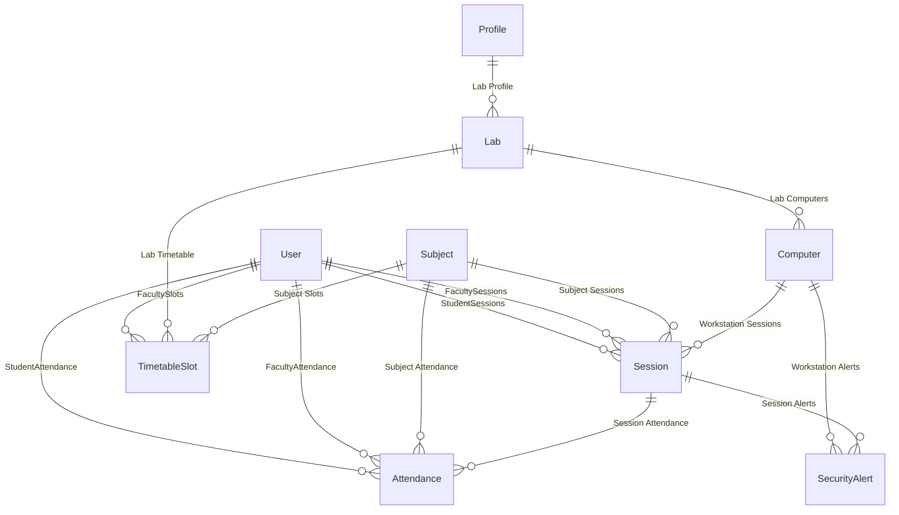

# ALAMS Database Schema Documentation

This document describes the database design for the **Aurxon Lab Access Management System (ALAMS)**. The database is built on **PostgreSQL** (hosted via Neon) and managed using **Prisma ORM**.

---

## Data Models and Relational Diagram

The system contains ten core models supporting student registration, lab session control, timetables, and audit logging.

---

## 1. User Model (`users`)
Stores credentials, roles, and status for administrators, supervisors, faculty, and students.

| Field Name | Type | Attributes | Description |
| :--- | :--- | :--- | :--- |
| `id` | `String` | `@id`, `UUID` | Primary key |
| `enrollmentNumber` | `String` | `@unique` | Student Enrollment ID or Admin/Faculty Email |
| `passwordHash` | `String` | | bcrypt hashed password |
| `pinHash` | `String` | | bcrypt hashed 6-digit PIN for offline fallback |
| `fullName` | `String` | | Full name of the user |
| `role` | `Role` | `STUDENT` | Enum: `STUDENT`, `ADMIN`, `SUPERVISOR`, `FACULTY` |
| `isActive` | `Boolean` | `true` | Status flag |
| `mustChangePassword`| `Boolean` | `true` | Force password reset on first login |
| `passwordChangedAt` | `DateTime` | `Nullable` | Last password change timestamp |
| `lastLogin` | `DateTime` | `Nullable` | Last login timestamp |
| `createdAt` | `DateTime` | `now()` | Account creation timestamp |

---

## 2. Profile Model (`profiles`)
Defines workstation restriction profiles applied at the Lab level.

| Field Name | Type | Attributes | Description |
| :--- | :--- | :--- | :--- |
| `id` | `String` | `@id`, `UUID` | Primary key |
| `name` | `String` | `@unique` | Profile name (e.g. "Engineering Lab") |
| `qrLifetime` | `Int` | `60` | Validity in seconds of dynamic QR code tokens |
| `heartbeatInterval` | `Int` | `30` | Heartbeat expectation frequency in seconds |
| `offlinePinEnabled` | `Boolean` | `true` | Allows local passcode fallback unlock |
| `sessionTimeout` | `Int` | `120` | Maximum student session duration in minutes |
| `idleTimeout` | `Int` | `15` | Lock screen idle timeout in minutes |

---

## 3. Lab Model (`labs`)
Zones representing physical laboratory locations.

| Field Name | Type | Attributes | Description |
| :--- | :--- | :--- | :--- |
| `id` | `String` | `@id`, `UUID` | Primary key |
| `name` | `String` | `@unique` | Friendly name (e.g. "SUAS Lab A") |
| `location` | `String` | `Nullable` | Building/Room designation |
| `subnet` | `String` | `Nullable` | Allowed subnet CIDR (e.g. "10.0.3.0/24") |
| `profileId` | `String` | `Nullable` | Foreign key referencing Profile |

---

## 4. Computer Model (`computers`)
Tracks physical workstations and hardware fingerprints.

| Field Name | Type | Attributes | Description |
| :--- | :--- | :--- | :--- |
| `id` | `String` | `@id`, `UUID` | Primary key |
| `labId` | `String` | | Foreign key referencing Lab |
| `pcNumber` | `String` | | Seat index number (e.g. "PC-01") |
| `deviceName` | `String` | `@unique` | NetBIOS computer hostname |
| `ipAddress` | `String` | | Local IPv4 address |
| `macAddress` | `String` | `@unique` | Primary network adapter MAC Address |
| `fingerprint` | `String` | `@unique`, `Nullable` | Combined SHA-256 hardware specs hash |
| `qrSeed` | `String` | | Cryptographic signing seed key |
| `fallbackEnabled` | `Boolean` | `true` | Permits offline PIN logins |
| `status` | `ComputerStatus`| `PENDING` | Enum: `PENDING`, `APPROVED`, `ACTIVE`, `MAINTENANCE`, `BLOCKED`, `RETIRED` |
| `lastSeen` | `DateTime` | `now()` | Last heartbeat timestamp |
| `watchdogHeartbeat`| `DateTime` | `Nullable` | Last watchdog process heartbeat |
| `trustStatus` | `String` | `"TRUSTED"` | Security trust evaluation |
| `computerUuid` | `String` | `Nullable` | System UUID |
| `machineGuid` | `String` | `Nullable` | Cryptographic Machine Guid |
| `motherboardSerial`| `String` | `Nullable` | Board Serial Number |
| `cpuId` | `String` | `Nullable` | Processor ID |
| `biosSerial` | `String` | `Nullable` | BIOS Serial Number |
| `ram` | `String` | `Nullable` | Physical RAM Spec |
| `storage` | `String` | `Nullable` | Hard Drive capacity spec |
| `osVersion` | `String` | `Nullable` | OS Name & Build |
| `clientVersion` | `String` | `Nullable` | Client App Version |

---

## 5. Subject Model (`subjects`)
Academic subjects linked to lab practical classes.

| Field Name | Type | Attributes | Description |
| :--- | :--- | :--- | :--- |
| `id` | `String` | `@id`, `UUID` | Primary key |
| `name` | `String` | | Subject name (e.g. "Computer Networks") |
| `code` | `String` | `@unique` | Code (e.g. "CS-302") |

---

## 6. TimetableSlot Model (`timetable_slots`)
Weekly scheduled classes matching students, subjects, labs, and faculty.

| Field Name | Type | Attributes | Description |
| :--- | :--- | :--- | :--- |
| `id` | `String` | `@id`, `UUID` | Primary key |
| `labId` | `String` | | Foreign key referencing Lab |
| `subjectId` | `String` | | Foreign key referencing Subject |
| `facultyId` | `String` | | Foreign key referencing User (Faculty) |
| `dayOfWeek` | `Int` | | 0 (Sunday) to 6 (Saturday) |
| `startTime` | `String` | | HH:MM format start |
| `endTime` | `String` | | HH:MM format end |
| `semester` | `String` | | Class semester target |
| `branch` | `String` | | Student department branch |
| `section` | `String` | | Section division |
| `batch` | `String` | | Practical batch division (e.g. "B1") |

---

## 7. Session Model (`sessions`)
Individual workstation unlocks and lock events.

| Field Name | Type | Attributes | Description |
| :--- | :--- | :--- | :--- |
| `id` | `String` | `@id`, `UUID` | Primary key |
| `userId` | `String` | | Foreign key referencing User (Student) |
| `computerId` | `String` | | Foreign key referencing Computer |
| `loginTime` | `DateTime` | `now()` | Unlocked session start time |
| `logoutTime` | `DateTime` | `Nullable` | Workstation lock time |
| `durationMinutes` | `Int` | `Nullable` | Total minutes elapsed |
| `unlockLatencyMs` | `Int` | `Nullable` | Network latency offset during QR unlock |
| `verificationMethod`| `VerificationMethod`| | Enum: `QR_CODE`, `PIN_FALLBACK`, `ADMIN_OVERRIDE` |
| `status` | `SessionStatus` | `ACTIVE` | Enum: `ACTIVE`, `COMPLETED`, `TERMINATED`, `PENDING` |
| `oneTimePin` | `String` | `Nullable` | Active 2FA session unlock PIN code |
| `pinExpiresAt` | `DateTime` | `Nullable` | Expiration timestamp of the PIN (60s) |

---

## 8. Attendance Model (`attendance`)
Aggregated academic presence records matching active sessions.

| Field Name | Type | Attributes | Description |
| :--- | :--- | :--- | :--- |
| `id` | `String` | `@id`, `UUID` | Primary key |
| `userId` | `String` | | Student User relation ID |
| `sessionId` | `String` | | Session link ID |
| `date` | `DateTime` | `now()`, `@db.Date` | Calendar date |
| `checkIn` | `DateTime` | `now()` | Check-in timestamp |
| `checkOut` | `DateTime` | `Nullable` | Check-out timestamp |
| `status` | `AttendanceStatus`| `ABSENT` | Enum: `PRESENT`, `LATE`, `PARTIAL`, `ABSENT`, `EXCUSED`, `MANUAL_OVERRIDE` |
| `duration` | `Int` | `Nullable` | Cumulative duration in minutes |

---

## 9. SecurityAlert Model (`security_alerts`)
Stores workstation violations reported by the Watchdog service.

| Field Name | Type | Attributes | Description |
| :--- | :--- | :--- | :--- |
| `id` | `String` | `@id`, `UUID` | Primary key |
| `computerId` | `String` | `Nullable` | Computer relation link |
| `sessionId` | `String` | `Nullable` | Session relation link |
| `alertType` | `String` | | Violation tag (e.g. `watchdog_kill`) |
| `alertSeverity` | `AlertSeverity` | `WARNING` | Enum: `INFO`, `WARNING`, `CRITICAL` |
| `details` | `String` | `Nullable` | Narrative of security bypass |
| `alertTime` | `DateTime` | `now()` | Timestamp of incident |
| `resolved` | `Boolean` | `false` | Status tag |

---

## 10. AuditLog Model (`audit_logs`)
Aggregates administration and system operations logs.

| Field Name | Type | Attributes | Description |
| :--- | :--- | :--- | :--- |
| `id` | `String` | `@id`, `UUID` | Primary key |
| `action` | `String` | | Logged action keyword |
| `userId` | `String` | `Nullable` | Acting user ID link |
| `computerId` | `String` | `Nullable` | Affected workstation ID link |
| `details` | `String` | | Operation particulars |
| `createdAt` | `DateTime` | `now()` | Log creation timestamp |
